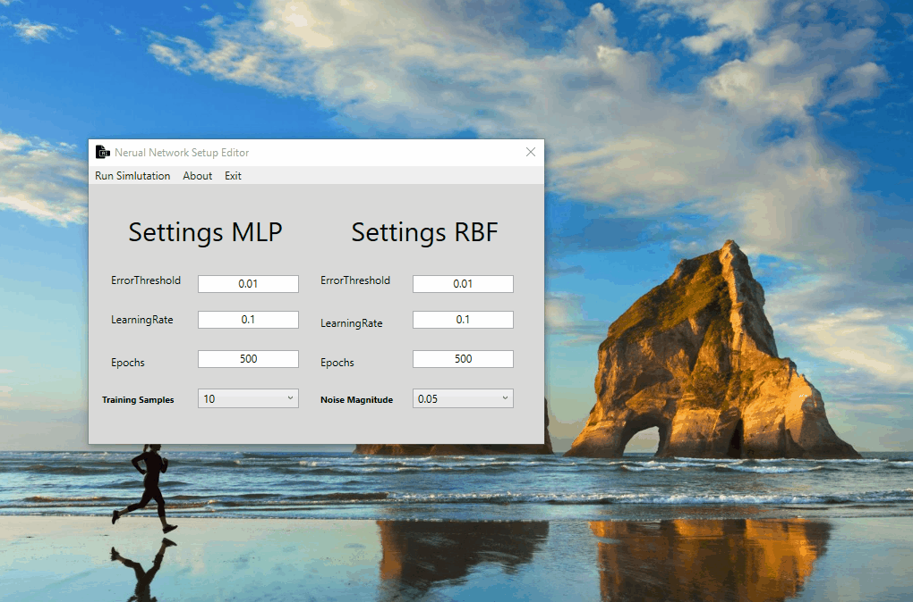

# Compute Game AI

The Computer Game AI module taught students basic neural network types such as the multi layered perceptron and radial basis function networks. The module was assessed with a report where we had to compare these to network types for approximating a function and an exam which asked questions on neural networks and pathfinding.  
 
## Assignment

The assignment was to compare a RBF and a MLP for approximating a fixed function.

## Submission

To aid in my analysis I wrote a C++ application that simulates both neural networks when presented with an XML file.

## License

MIT