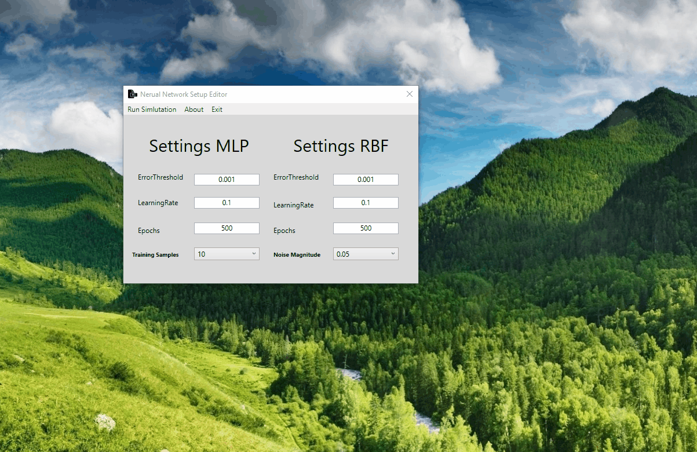

# Compute Game AI

The Computer Game AI module taught students basic neural network types such as the Multi Layered Perceptron (MLP) and Radial Basis Function (RBF). The module was assessed with a report where we had to compare our own custom RBF and MLP for approximating a fixed function and an exam which asked questions on neural networks and pathfinding. While students did not need to program their networks I decided to so I could easily view outputs, experiment with variables and record training times. 
 
## Assignment

As stated the assignment was to design and compare a RBF and a MLP for approximating a fixed function. With each network designed we were then asked to vary the following parameters in the networks. Extra marks were given for coding the solution yourself rather than using MATLAB or other online sources. 

* **MLP**
    * Number of hidden neurons
    * The learning rate
    * Values of momentum term

* **RBF**
    * Number of RBFs
    * The RBFs width
    * The position of the RBFs

## Submission

Once I had designed a basic RBF and MLP I then decided to write two applications to aid in writing the report. These applications helped output the result when marking the differences between the two networks and gave graphical representations that I could use in the report to demonstrate effects of varying variables.

#### Network Program

The network program was a C++ application that would take neural network settings in from an XML file, train both the RBF and MLP networks and output the trained networks approximations using FreeGLUT and OpenGL. This OpenGL output can also be inspected by using the arrow keys for moving around the graph and the W and S keys for zooming in and out.

#### Ui Program

A UI program was also written in C# with WPF which runs the network program and provides a clean way to mutate the XML file that is read in the first program. The user can specify all fields found in the XML file and launch off multiple instances to view the results in real time.

## License

Apache 2.0
